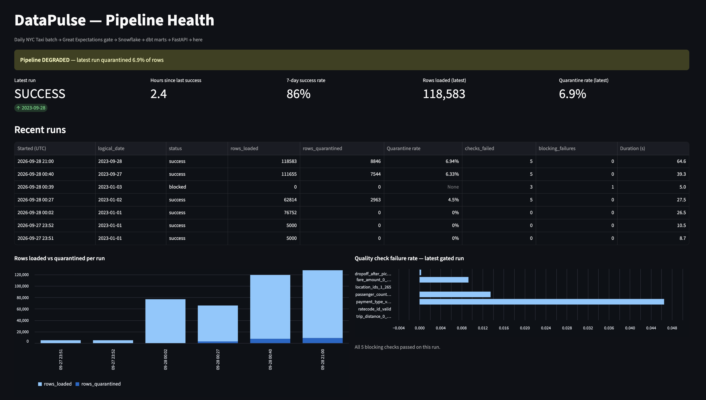
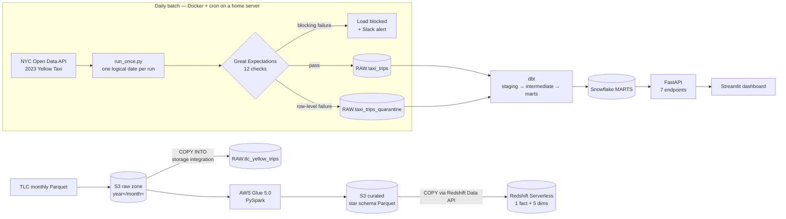
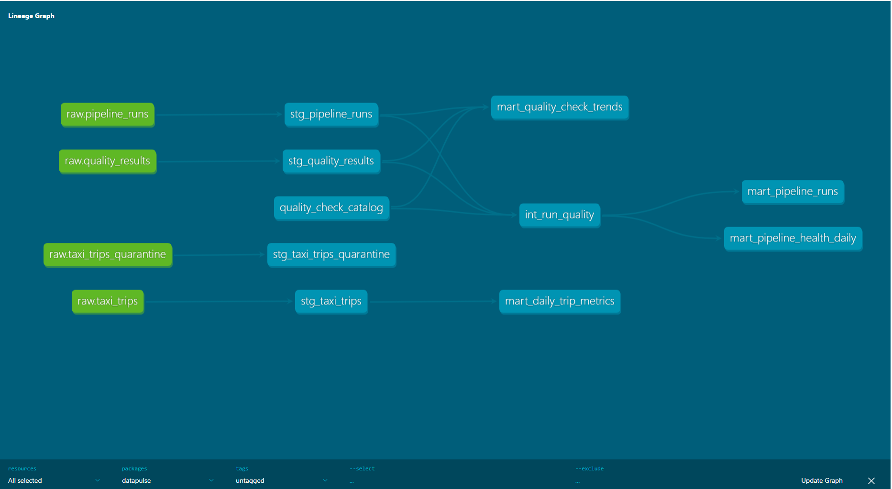
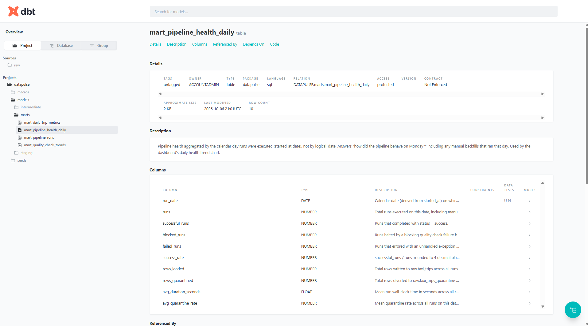

# DataPulse — Data Pipeline Monitor with Quality Gates


A production-style batch pipeline for NYC Taxi trip data that **refuses to load
data it can't trust**. A daily job ingests trips into Snowflake behind a
12-check Great Expectations gate, dbt models the results into marts, and a
FastAPI service plus Streamlit dashboard report pipeline health. A parallel
AWS path (S3 → Glue/PySpark → Redshift Serverless) builds a star schema from
the monthly TLC files.

Everything here has run for real: the numbers below come from actual runs,
not estimates. Build history and the reasoning behind each decision are in
[`LEARNING_LOG.md`](LEARNING_LOG.md).



*The dashboard shows **DEGRADED** on purpose: the latest run succeeded but
quarantined 6.9% of rows, above the 5% threshold. It also lists a real
**blocked** run (1 blocking failure, 0 rows loaded).*

## Architecture



## Results from real runs

| What | Result |
|---|---|
| Daily API batch | ~66K–127K trips per logical day, loaded in 26–65 s |
| Idempotent reloads (Snowflake) | Same day loaded twice → **5,000 rows, not 10,000**; 76,752 rows = 76,752 distinct `trip_id`s |
| Quality gate | **12 checks** (5 blocking, 7 row-level); a truncated 300-row batch was **blocked with 0 rows loaded**; bad rows quarantined by named check (e.g. 2,963 of 65,777 on 2023-01-02) |
| Unattended schedule | cron run at 21:00 UTC loaded 2023-09-28: 118,583 rows + 8,846 quarantined, exit 0 |
| S3 → Snowflake | **3,066,766** rows from the S3 raw zone via storage integration + `COPY INTO` — the same count Glue read from that file; rerun loaded **0 files** (per-file load metadata) |
| Glue → Redshift star schema | **3,066,766** January 2023 trips in → **3,066,690** in `fact_trips` (48 outside the month, 28 impossible durations excluded); Glue 185 s ≈ $0.05 |
| Idempotent reloads (Redshift) | January reloaded → still 3,066,690 rows |
| dbt | 9 models, 1 seed, 21 tests → `PASS=31` in 11 s; source freshness PASS |
| API | 7 endpoints, post-deploy smoke test all `200` against the real warehouse |
| Tests | 72 pytest + 1 Streamlit render test; CI runs ruff, bandit, pytest, `dbt parse` |

## How it works

**Daily batch (`ingestion/`).** Each run processes one *logical date*. The
source is historical (2023), so a run on 2026-09-28 replays 2023-09-28, and
any day can be rerun with `--date`. Pages are pulled with a `$where` date
window and `$order=:id`, since Socrata's offset paging is only stable with a
stable order. `trip_id` is a SHA-256 of the full source record. The day is
loaded with `write_pandas` into a temp table, then **deleted and re-inserted
in one transaction**, so reruns are idempotent and source corrections replace
stale rows.

**Quality gate (`quality/gate.py`).** The 12 checks come in two tiers:
- **5 blocking checks:** source schema, `trip_id` not null and unique, pickup
  not null, and row count within 0.5–2× of the previous successful run.
  Any failure means nothing loads, the run is marked `blocked`, and Slack is
  alerted.
- **7 row-level checks:** dropoff after pickup, fare, distance, passengers,
  payment and rate codes, and location IDs. Failing rows go to a quarantine
  table with the names of the checks they failed. The rest load, and Slack
  gets a warning above a 5% failure rate.

Real TLC data is dirty by nature (refunds are negative fares), so blocking on
every rule would mean the pipeline never loads.

**S3 → Snowflake (`ingestion/load_s3_to_snowflake.py`).** Monthly TLC Parquet
in the S3 raw zone is loaded with an external stage and `COPY INTO`. A
storage integration means Snowflake assumes a read-only IAM role locked to
its own identity and an external ID, with no AWS keys anywhere. `COPY`'s
per-file load metadata makes reruns a no-op.

**Glue → Redshift star schema (`transforms/`, `redshift/`, `scripts/aws/`).**
- **Model:** `fact_trips` (one row per trip) plus `dim_date`, `dim_time`,
  `dim_zone` (role-playing for pickup and dropoff), `dim_payment_type`, and
  `dim_rate_code`. Vendor is a degenerate dimension.
- **Keys:** smart keys for date and time, and an Unknown (−1) member in every
  lookup dimension. Money is `DECIMAL(10,2)`.
- **Job:** the Glue job writes partitioned Parquet with dynamic partition
  overwrite. Redshift loads it with `COPY` through the Redshift Data API,
  in one transaction per month.

**dbt lineage** (generated with `dbt docs generate`):

[](docs/img/dbt_lineage.png)

**dbt data dictionary** (column-level descriptions generated with `dbt docs generate`):

[](docs/img/dbt_data_dictionary.png)

**dbt (`dbt/`).**
- **Layers:** staging views (1:1 with raw, rename and cast only), an
  intermediate model joining runs to check results, and mart tables for
  serving.
- **Seed:** a `quality_check_catalog` seed holds each check's severity. A
  pytest asserts it matches the real gate code.
- **Freshness:** source freshness on `raw.pipeline_runs` warns if runs stop
  arriving.

**API and dashboard (`api/`, `dashboard/`).**
- **Data flow:** Streamlit → FastAPI → dbt marts. Only the API container
  holds Snowflake credentials.
- **Health endpoints:** `/health` is liveness and never touches the
  warehouse; `/health/ready` is readiness.
- **Status rules:** status is `healthy`, `degraded` (blocked, partial, or
  more than 5% quarantined), or `down` (no success in 36 h, or the latest run
  failed). The 36 h threshold is the same as dbt freshness.
- **Caching:** a 60 s cache means dashboard refreshes don't keep waking the
  warehouse.

## Key design decisions

| Decision | Why |
|---|---|
| Partition overwrite, not MERGE | A content-hash key gives a corrected row a *new* hash, so MERGE would keep the stale row. Delete + insert per day in one transaction is idempotent *and* correct. |
| Two-tier quality gate | Distinguishes "this batch is untrustworthy" (block) from "this row is bad" (quarantine), so the pipeline keeps loading while nothing is silently dropped. |
| Schema check on *source* columns | Checking the mapped frame would be circular. This check would have caught an early bug where the job read the wrong Socrata dataset. |
| Storage integration for S3 → Snowflake | No AWS keys in Snowflake; read-only role scoped to `raw/tlc/*`, locked by external ID. |
| Glue writes Parquet, Redshift `COPY`s it | Avoids Glue→Redshift JDBC VPC networking; the curated S3 layer is reusable. |
| `DELETE`, not `TRUNCATE`, in Redshift loads | `TRUNCATE` commits immediately in Redshift and would break the all-or-nothing batch. |
| Dims `DISTSTYLE ALL`, fact `AUTO`, `SORTKEY(pickup_date_key)` | Local joins for tiny dims; a zone distkey would skew (Midtown and the airports dominate). |
| dbt and dashboard in their own images | dbt-snowflake needs connector 4.x while ingestion pins 3.12; the dashboard needs no warehouse credentials at all. |
| Ports bound to a Tailscale IP | Docker-published ports bypass UFW; binding to the tailnet keeps the dashboard private. |

## Repository layout

```
ingestion/     daily API batch (run_once.py), S3 -> Snowflake COPY loader
quality/       Great Expectations gate (12 checks)
alerts/        Slack webhook alerts
warehouse/     Snowflake client, raw schema, migrations
dbt/           staging -> intermediate -> marts, seed, tests
api/           FastAPI health service
dashboard/     Streamlit dashboard
transforms/    PySpark star schema (pure core + thin Glue wrapper)
redshift/      star schema DDL
scripts/       cron wrapper, smoke test, AWS create/run/load/teardown
infra/iam/     least-privilege IAM policies (Glue, Redshift, Snowflake)
deploy/        crontab
tests/learning concept tests (one file per component)
docs/          AWS runbook, resume evidence, screenshot
```

## Running it

**Prerequisites:** Docker, a Snowflake account, and optionally an AWS account
with the AWS CLI configured.

```bash
cp .env.example .env                 # Snowflake credentials, Slack webhook, bucket name
docker compose build
docker compose run --rm --entrypoint python ingestion -m warehouse.apply_schema

# one daily batch: API -> gate -> Snowflake raw
docker compose run --rm ingestion --date 2023-01-02

# dbt models + tests
docker compose run --rm dbt build

# API (:8010) and dashboard (:8501)
docker compose up -d api dashboard
bash scripts/smoke_api.sh http://127.0.0.1:8010
```

**Schedule:** install `deploy/crontab`. `scripts/run_daily.sh` runs API
ingestion, then the S3 `COPY`, then `dbt build` and source freshness, and
logs to `logs/daily_run.log`.

**AWS path:** follow [`docs/aws_runbook.md`](docs/aws_runbook.md) (bucket,
IAM roles, Glue job, Redshift Serverless, Snowflake storage integration).
`scripts/aws/teardown.sh` removes every AWS resource.

## Testing and CI

GitHub Actions runs on every push:
- **ruff** and **bandit** (security lint)
- **pytest** (72 concept and unit tests, including a real local Spark session for the star schema)
- **`dbt parse`** in an isolated venv
- a **Streamlit AppTest** that renders the real dashboard against a fake API

After a deploy, `scripts/smoke_api.sh` calls every endpoint against the real
warehouse. It catches warehouse-specific SQL errors that unit tests with fakes
can't.

## Cost

In practice the AWS path costs cents: the Glue run was about $0.05, Redshift
Serverless bills only while queries run (4-RPU base, with a daily RPU-hour
usage limit as a hard cap), and S3 holds about 200 MB. A $10 AWS Budget
alerts on anything unexpected.

## Not implemented

Stated plainly so nothing is overclaimed:
- **Terraform:** infrastructure is created by reviewed CLI scripts, not IaC.
- **Step Functions:** the Glue path is started by a script, not orchestrated.
- **Athena / Glue Data Catalog:** the curated Parquet is Athena-ready but not
  registered.

## License

MIT, see [`LICENSE`](LICENSE).
